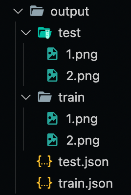

# VoTT2COCO
A tool to convert VoTT annotations to COCO annotations

## 🔨 Usage
Written below is an example of how you would use this tool:

```bash
python main.py --train-ann example/train_folder/annotation/ --test-ann example/test_folder/annotation/ --output-dir output
```

`--train-ann`: Path to train annotations

`--test-ann`: Path to test annotations

`--output-dir`: Path to output directory

## 📚 Notes
- This tool does **not** translate segmentation annotations
- You must **manually** move your images and the output annotations (produced by this tool) to the train and test folders in the specified output directory after the tool has completed its task

Here is a sample output folder structure:



## 🎉 Contributing
If you find any bugs or potential features, feel free to write an issue or make a pull request!
